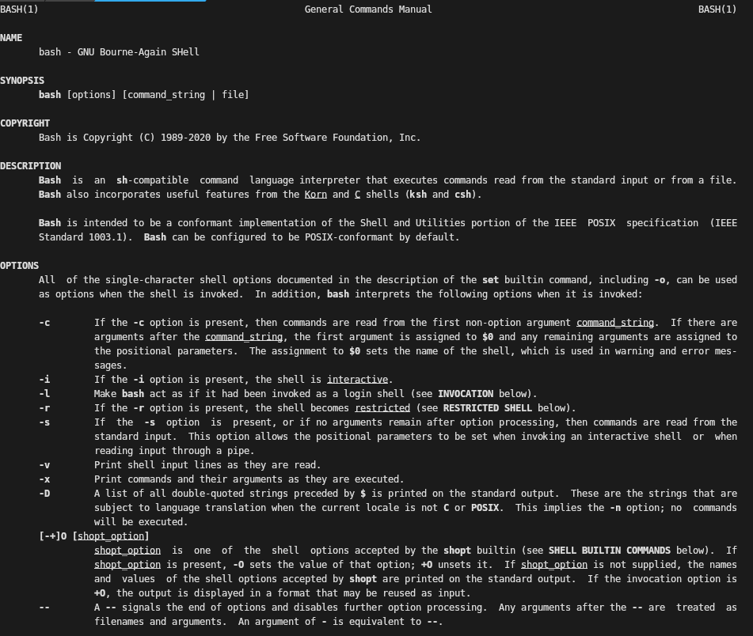
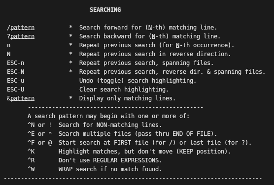
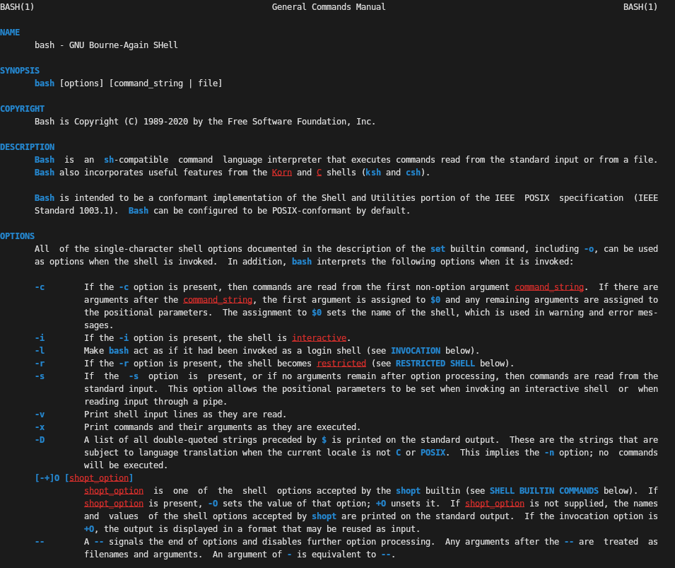
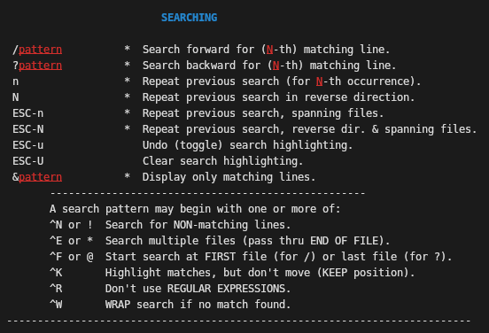

Bash isn't a trendy shell like `zsh` or `fish`.
It doesn't boast fancy colours and auto-complete suggestions out of the box.
Some of the syntax _is_ admittedly a bit awkward.
For all that, it's still my shell of choice.

This article explains how I configure `bash` as my daily driver to overcome some of its limitations.
If you use `bash`, you might find a few of these tips handy for improving your own experience.
If you already use another shell, you might not be persuaded to change back, but you might pick up a few ideas all the same.

## Why bash?

Before explaining how I configure bash, it's worth taking a moment to discuss _why_ I still use it, even thought trendier alternatives exist.

The primary motivation is that _bash is ubiquitous_.
Practically every modern flavour of Linux provides bash out of the box, from container images like `busybox` to mainstream OS distros like Ubuntu and Red Hat.
Even on Windows, `git-bash` and WSL default to bash as their shell of choice.
By sticking with the default, it's easy to switch between different environments that I haven't configured, such as when interacting with coworkers or jumping into debugging issues.

Relatedly, it's much easier to find help for commonplace tools than for more niche ones!
Zsh is quite popular, so this isn't a strong argument against it, but it's always a reason to keep in mind when evaluating one's stack.

The next reason to stick with the standard option is that it's reasonably powerful.
Sure, it isn't as glitzy as some of the alternatives, but I personally prefer a functional, productive environment that looks plain than one packed with visual bells and whistles that distract me from what I'm trying to do.
This is a highly subjective point, but personally I'm not a fan of tools that throw too much information at the user and try to draw their attention to things they don't need to think about all the time.
For example, I don't include a git branch in my PS1 (de facto shell prompt) because I can query this when I'm interested in it.
Nor do I see the point in installing a plugin to tell me the time when it's as easy to write into my `bashrc` once.
The point is, you can do a lot with bash, and for plenty of common tasks it's no harder than anything else.

The final justification for sticking with bash is that it needs only a few tweaks to bring it up to par...

## Assauging Asymmetry

One of the most irritating things about a default bash setup, in my opinion, is that actions are asymmetric.
Let me explain what I mean.

Bash provides a number of keyboard shortcuts out of the box.
I'm not sure many people are even aware of this, based on the number of coworkers I've seen navigating entirely by left/right arrows and the delete key.
Bash has a rich set of movements like:
* alt-b to move back a "word",
* alt-f to move forward a "word"
* alt-d to delete forward a word
* control-w to delete back a "word"
* control-u to delete back to the beginning
* control-k to delete forward to the end

These are the ones I use the most -- practically every day, in fact!

Note how I used quotation marks around "word".
That's because I don't agree with how bash interprets that term, or rather how it interprets it _inconsistently_.
You see, moving back and forward and deleting forward obeys what I consider normal rules: punctuation delimits a word.
Deleting backwards, however, words on the basis of _whitespace_, not punctuation.

A few years ago, I ended up so fed up of this I went down the rabbit hole to figure out what could be done to fix it.
The solution, it turns out, is trivial: you just change the key bindings for whichever modes you care about.
As an aside, you might not be aware that bash has two built-in modes -- Emacs (the default) and Vim.

I now have the following in my `bashrc`:

```bash
stty werase undef
bind -m emacs "\C-w": backward-kill-word'
bind -m emacs "\e\C-w": unix-word-rubout'
```

This is frankly a bit arcane, so let's see what this means.
The command `stty` deals with _settings for the terminal_, hence the name.
This first line removes the binding it has for `werase`, or "word erase".
The second line states that control-w should use a deletion approach which respects punctuation, while the third line says that control-alt-w should use a deletion approach which respects only whitespace.
In this way, I retain the existing action (delete back to whitespace), but on a different binding; this is helpful when I have something like a URL that I want to delete.
The binding I use the most is the one which respects punctuation, and thus is symmetric with deleting forwards a "word".

There are tens of other bindings if you run:
```bash
bind -ls
```

I haven't played around with configuring many of the others, although partly that's because I'm happy with many of them.
You might find things that enormously improve your UX, so I'd encourage you to take a look!

## Not letting go

The next trick isn't unique to bash, but I do find it very useful when you don't have (history-based) auto-complete suggestions.
This is enabling _eternal history_.

By default, the history of which shell commands you've run is finite, and typically using what I'd consider to be a rather modest number.
I prefer enabling eternal history: I want to know about what commands I've run in the past, even if I've not run them recently.
In fact, it's most often the ones I've not run recently that I need help remembering!

To enable this, I set:
```bash
shopt -s histappend
export HISTSIZE=
export HISTFILESIZE=
export HISTFILE=~/.bash_eternal_history
```

By effectively unsetting the history size, this removes the limit.
Note that we do this for both the current shell session _and_ the history file (shared between sessions).

You might also wish to use the following:
```bash
PROMPT_COMMAND="history -a; history -n; $PROMPT_COMMAND"
```

This appends history as it happens and makes sure the current shell is up to date with any history that other shells have written since the last command it executed.
Depending on how to you like to manage your sessions, you might find one or both of these settings more aggravating than advantageous.

There are additional settings to allow for excluding certain commands from history or to prevent duplication of existing commands (although I've yet to configure this one correctly).
At worst, you can use other tools like an editor or `sed` or `uniq` to get rid of history you aren't concerned about, but I've not encountered any issues with excessive history retention so far, either at work or at home.

## When less is more

Once again, this isn't specifically a tip for bash, but it's something that makes my time using bash that much more enjoyable and productive.
It's also something I've never seen anyone else do, just like with fixing that stty/bind configuration!

You, dear reader, are most likely familiar with the pager utility `less`.
As you're probably aware, `less` is the default pager for the outputs of many other commands, such as `man` pages.
Now, `less` is an enormously powerful and underappreciated tool that deserves a blog post in its own right, but I'd like to mention one helpful feature of it: coloured content!

By default, `less` doesn't apply any colour to what it's paging through.
For something short, like the man-page of a simple command, that's not a problem.
However, if you're like me, then scanning over the output of `man bash` tends to leave me glazing over at what feels like miles of text.
It's blank, it's boring, it's monotonous, it's monochrome.
Humans like colour -- it's great for conveying information.

Allow me to introduce to you `LESS`, the shell variable for telling `less` how to behave.
Mine is set to the following:
```bash
export LESS='FRDd+b$Du+r'
```

If you thought those `bind` commands were obtuse, welcome to a-whole-nother level!
The key bits here are those `+b` and `+r` fragments, which tell `less` to use blue and red respectively for bold and underlined text.
All `less` is doing is reading the existing formatting style of the text and applying some colour-mapping to it, so there's nothing special you need to do here.
It's a simple thing, but I find it enormously easier to spot what I care about:
* Bold typically indicates _options_ or _configuration_ flags.
* Underlining typically indicates named entities in the body of text.

You can see the difference a dash of colour makes in the screenshots.
The first two are from running `man bash` then part of the `less` help docs entered by then pressing `h` in any `less` window:




The next two are the same screens, but with the foregoing colour definitions applied.
Notice how the coloured text draws the eye much more effectively than emboldened or underlined text, which for me at least tends to blend into a larger page.




## Efficient Edits

Earlier on, it was mentioned that there are plenty of shortcuts pre-assigned in bash, such as for moving forward and backward a word.
Nifty navigation is a valuable and time-saving skill (I frequently jump to the start or end of a line, or forward or backward a couple of words), but it really helps to be able to _edit_ a line, not just navigate around it.

Bash has plenty of commands for this very purpose!
We've already seen a few, but let's recap them for convenience:
* __alt-d__ to delete the next word
* __control-w__ to delete the last word
* __control-u__ to delete to the start of the line
* __control-k__ to delete to the end of the line

### Undo!  Undo!

There's a built-in undo buffer, available via __alt-x followed by alt-u__, i.e. while pressing alt press x then press u.
I like to use the remember this as __eXecute Undo__.
This can be used multiple times to reverse multiple changes to the current command.
Do not that undoing things is purely about editing the current line, not reversing the behaviour of anything that has already happened.

### Escaping Emacs-Mode

For when navigating around word by word and making these small sorts of changes is just a bit too inconvenient, there's an escape hatch in the form of __alt-x followed by alt-e__.
My mnemonic for this is __eXecute Edit__.
It'll bring up your whatever variable you've set in your `$EDITOR` environment variable, probably defaulting to `vi` or `vim` as a fallback.
This is particularly useful when you can't remember the Emacs-mode bash command you need or if you're editing a larger block of text.

### Making the Same Argument Again

Sometimes you just want to use an argument to a preceding command, quite probably even the last one.
For example, perhaps you need to ensure a directory exists before running something else, as in:

```bash
mkdir -p foo/bar/baz
mv a/b/c foo/bar/baz
```

The shortcut __alt-.__ (alt and the dot/period character together) provides access to the last argument to the last command.
I use this frequently, and find it can be useful to think about the order in which arguments are supplied to programs so as to maximise the utility of this trick.

### The Old Switcharoo

Sometimes I find I need to make an edit somewhere in the middle of a fairly long previous command.
Normally, one would press the up arrow, navigate forward or backward however many words, then change perhaps a few characters (correcting a typo, changing the case of a letter, and so on).
This is tedious and irritating, but there's a better way!

Enter our friend the caret: __^__.
Carets allow for __quick substitutions__ to the preceding command (or more properly the preceding shell history entry).
They can be used with either two or three carets, like so:

```bash
ls /home/usernam # Note the missing 'e' in 'username'
^nam^name # ls /home/username
# Alternatively...
^nam^name^ # ls /home/username
```

Quick substitutions are one of a family of bash utilities called [event designators](https://www.gnu.org/savannah-checkouts/gnu/bash/manual/bash.html#Event-Designators).
In fact, the caret syntax is just a shorthand for the full-form substitution command, which we'll look at next.

### Switcharoo 2: Substitution Boogaloo

The full-form substitution looks like this:

```bash
!!:s/foo/bar/<modifiers>
```

Where modifiers are one of the list specified [here](https://www.gnu.org/savannah-checkouts/gnu/bash/manual/bash.html#Modifiers).
Mostly I use full-form substitutions when I need to apply the `g` (global) flag, but `p` (print instead of executing) can be very helpful for checking a substitution before applying it.

Do note that substitutions need not happen on only the _last_ command, but can be applied further back in history too.
I don't personally make full use of this facility because of how I tend to explore shell history, but it can be incredibly helpful on an unfamiliar machine or one on which it is not possible to install one's usual setup.

---

* Supercharging with fzf
  * Mention my preferred settings, e.g. colours for command types
* Using `bashrc.d/...` style to organise config
  * Allows for selectively disabling settings if unneeded
  * Keeps things separated so not just one huge blob of a file
* A few neat tricks like `^.`, `^x-u`, etc.
