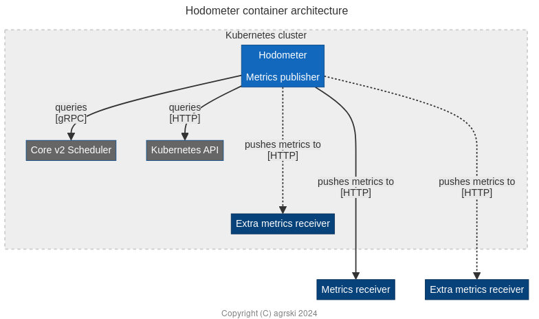
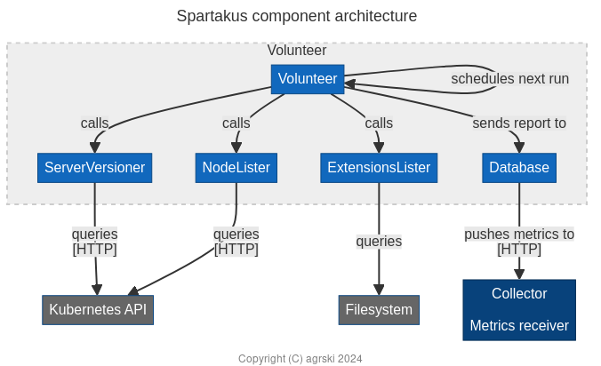

Hodometer is an optional component of Seldon Core v2 responsible for collecting anonymous usage metrics.
The name comes from the [ancient device](https://en.wikipedia.org/wiki/Odometer) for measuring distance, familiar in cars as an _odometer_, because it's all about keeping track of your mileage!

Let's consider how metrics were handled in Core v1, why we opted for a different approach in Core v2, and how Hodometer actually works.

## Spartakus in Core v1

[Spartakus](https://github.com/kubernetes-retired/spartakus/tree/master/docs#extensions) was an open-source project created in 2016 by Tim Hockin as part of the larger Kubernetes (k8s) work.
It was designed, in its own words, for "collecting usage information about Kubernetes clusters."

Two notable points about its design were that it explicitly _did not_ collect personally identifiable information (PII) and that it was an optional add-on with no impact on the running of k8s itself.
In order to provide anonymity, the cluster ID was under the user's control and (generally) randomly generated, meaning it would change with every new deployment.
As we'll see, these design decisions influenced the design of Hodometer as well.

Despite being intended for use by the k8s developers, Spartakus supported running against one's own data collection endpoints.
Out of the box, it had support for pushing metrics to Google's BigQuery, HTTP endpoints accepting JSON documents, and the local file handle `STDOUT`.
This made it easy enough to adopt for Core v1, where it's been powering the metrics ever since on monthly active nodes and so on published by Seldon.
For details on enabling Spartakus for Core v1, please refer to the [official documentation](https://docs.seldon.io/projects/seldon-core/en/latest/workflow/usage-reporting.html).

While convenient in the sense that it had already been written and made collecting _some_ metrics straightforward, Spartakus wasn't an ideal tool for application usage monitoring.
For a start, the project was deprecated and archived in 2019.
This led to the creation of the open-source [i-am-spartakus](https://github.com/SeldonIO/i-am-spartakus) repository a few weeks later by Seldon, to retain the project in maintenance mode.

Plenty of projects are archived, however, and maintaining a fork of something stable isn't much of a burden.
The larger problem with Spartakus was that the metrics it collected made sense for k8s, but not necessarily for other applications.
For example, the number of nodes in a cluster has no relation to how many ML deployments or models are on it, or what hardware resources those are consuming.
It also doesn't provide any information on which version of Core has been installed, or anything else that's application-specific.
Spartakus does support some custom data in the form of [extensions](https://github.com/kubernetes-retired/spartakus/tree/master/docs#extensions), but this is static information.
In any case, users may not even want to share all the data on nodes in a cluster that Spartakus collects by default.
To put it concisely, Spartakus collected lots of data that _wasn't_ of interest but didn't collect lots of data that _was_ of interest!

## A blast from the past --- inspiration from Spartakus

Core v2 is a very different kettle of fish from Core v1, and the sorts of metrics we'd want are no exception.
Core v2 has multiple Kubernetes custom resources --- _Models_, _Servers_, _Pipelines_, and _Experiments_ --- compared to just single one in Core v1 --- _SeldonDeployments_.
It furthermore introduces fundamentally new features in the form of multi-model serving (MMS) and over-commit.
When you consider these things, it should be clear that the metrics for Core v2 will want to be correspondingly more granular and domain-focused.

While Spartakus didn't provide ideal metrics even for Core v1, it did make a number of sensible design decisions to use as a basis for implementing usage metrics in Core v2.
Let's dip into each of these topics in turn.

### Optionality

Being a non-integral part of the system means Hodometer can safely and easily be enabled or disabled without any impact.
It is only reliant on (some of) the APIs exposed by the scheduler and some minimal information from k8s about the server version.

### Sensitive information

Not collecting any PII or otherwise potentially sensitive information avoids having to deal with things like the UK's GDPR regulations.
That's convenient from a business perspective, but it's also about building trust with end users that Hodometer isn't trying to spy on them.

The metrics Hodometer defines are about understanding adoption, seeing how widely particular versions are in use and if users upgrade quickly or if old versions still need to be supported, and about understanding if features are being utilised.
Do users actually make use of MMS?
If so, to what extent are they employing over-committing of servers?

### Anonymity

The use of ephemeral cluster IDs benefits anonymity, but was also done for simplicity of implementation.
The user can specify a cluster ID which Hodometer wil read from its environment, but if none is provided it will simply generate a new one at random.
In this latter case, whenever Hodometer restarts it will report metrics as being from a new "cluster".
That's a bit unhelpful for anyone wondering what the average age of clusters is or trying to count the number of active clusters in a given time period, but makes installations simpler and can inadvertently prevent longitudinal collection on long-lived clusters.

### Push model

Push-based metrics might seem like an odd thing to tout as a sensible design decision.
After all, Prometheus, one of the most popular metrics collection solutions, uses a [pull-based model](https://prometheus.io/docs/introduction/overview/) and justifies this briefly in its [FAQ](https://prometheus.io/docs/introduction/faq/#why-do-you-pull-rather-than-push?) and in more depth [in its blog](https://prometheus.io/blog/2016/07/23/pull-does-not-scale-or-does-it/).

In the case of Hodometer, however, the situation is very different.
While Prometheus wants to be aware of which services should be active and can employ service discovery, it would likely be very unpopular if an open-source tool were to have, or to need, these things to a third party.
In any case, it'd be rather impractical for the third party!
Instead, Core v2 is the active party and creates an outbound connection, which might be more acceptable from an administrative perspective than allowing inbound connections; if not, it can simply be disabled or blocked by a network policy.

By configuring the metrics receivers on the client side, it furthermore has the benefit that users can direct metrics to their own endpoints.

### Reporting frequency

Low periodicity is likewise an unusual thing to desire --- lots of systems are about collecting all the metrics, all the time!
Prometheus collects aggregated metrics but is often configured with a scrape interval between 10 seconds and one minute and will commonly be capturing tens to hundreds of time series per target, while some other systems are event-based and therefore even more granular, collecting information on every single things that happens.

In contrast, Hodometer runs infrequently --- only once every eight hours [at the time of writing](https://github.com/SeldonIO/seldon-core/blob/d3502062bbbb18a08032201917ceea07e124be41/hodometer/cmd/hodometer/main.go#L31).
There are a few reasons for this.
First of all, it should impose an absolutely minimal burden on user's networks and hardware resources.
Many cloud providers charge network egress costs, and Hodometer shouldn't be consuming compute resources that could be better used by the user's processes.

Aside from that, more frequent usage metrics aren't necessarily very useful.
As the point is to provide an _indication_ of how Core v2 is being adopted and which features are (not) being used, this level of granularity is sufficient.
Whether someone spins up a handful of extra inference servers for a few hours between Hodometer's runs or creates a new version of a pipeline before removing the old one doesn't fundamentally change the scale of adoption.
Indeed, many of the metrics should be naturally slow-changing, such as the versions of Kubernetes and Core, or tend to oscillate within stable ranges, such as the number of servers deployed at any given time.

I should note that this is based on assumptions and previous experience rather than hard data, but the nature of the problem means that precise data would be difficult and potentially controversial to attempt to collect.
Sampled and/or aggregated data are always subject to missing data points and loss of detail.
In any case, the collected metrics are generally further aggregated and assessed to identify _trends_, so inaccuracies in any given sample are highly unlikely to be significant in the grand scheme of things.

## Making more mileage

### Share and share alike

We've already touched upon the ability of end users to configure the metrics receiver endpoint.
One additional point to note here is that Hodometer supports _extra_ receivers.
This isn't something provided by Spartakus, but I decided to add it because it allows users to record the metrics whilst still providing them back to the maintainers.
The aim is once again to inspire confidence through visibility whilst benefitting the community as a whole by sharing this information in an anonymised way.

### Step by step

Another notable divergence from Spartakus is that Hodometer has the concept of _levels_ of metrics.
While Spartakus treated it is an all-or-nothing situation, Core v2 gives the user the option to share only as much information as they're comfortable with.

Making users select every individual metric would be tedious for them, so Hodometer groups these into levels: cluster-level, resource-level, and feature-level information.
Each level is a superset of its predecessor.
Cluster-level metrics are very basic: just the k8s and Core v2 scheduler versions (the scheduler is the heart of the control plane, so this implies the Core v2 version more generally).
Resource-level metrics count the number of each Core v2-defined _custom resource_, such as the number of models and pipelines.
It's important to note here that sensitive information like model names is _not_ recorded.
Feature-level metrics are about how many servers have multi-model serving and over-committing enabled and how much memory servers have available to them.
All of this can be seen in the `Collect` method [here](https://github.com/SeldonIO/seldon-core/blob/d3502062bbbb18a08032201917ceea07e124be41/hodometer/pkg/hodometer/collect.go#L227).

### Turn it off (and on again!)

Of course, if someone isn't happy sharing _any_ data, that's easy to configure too!
The simplest way to achieve this would be to disable Hodometer entirely.
Since the introduction of the `SeldonRuntime` custom resource in Core 2.6.0, there's a flag for this.
If you installed Core v2 with Helm, the relevant value is `hodometer.disable` in the [runtime Helm chart](https://github.com/SeldonIO/seldon-core/blob/d3502062bbbb18a08032201917ceea07e124be41/k8s/helm-charts/seldon-core-v2-runtime/values.yaml#L5).
Alternatively, you can update the [publish URL](https://github.com/SeldonIO/seldon-core/blob/d3502062bbbb18a08032201917ceea07e124be41/hodometer/cmd/hodometer/args.go#L38) Hodometer uses to point to your own receiver.

### Transparency

The final aspect of the design that I'd like to discuss is simplicity.
It was a conscious decision when creating Hodometer to prioritise legibility, particularly around the metrics themselves.
Keeping with the themes of visibility and trust, we wanted anyone evaluating Core v2 to be able to easily verify what metrics were defined and how these tied into the aforementioned levels of detail.
Even those without experience with Go and possibly very little knowledge of coding generally should be able to navigate to and understand the intent of the metrics and relation to levels, as a minimum.

This is why the metrics are defined in [their own file](https://github.com/SeldonIO/seldon-core/blob/d3502062bbbb18a08032201917ceea07e124be41/hodometer/pkg/hodometer/metrics.go) and structured the way they are with very explicit naming.
Of course, this is convenient for maintainers too, but the primary motivation was around casual readers without tools like an IDE.
The rest of the internal architecture of Hodometer is relatively straightforward too, but let's spare a moment to discuss it.

## Architecture

Before diving straight into the internals of Hodometer, let's recap its high-level interactions with other services.
If you're familiar with the [C4 model](https://c4model.com/) for software diagrams, this will be using the container- and component-level views.

### Hodometer container view

Hodometer makes requests to the Core v2 scheduler and Kubernetes (Discovery) API to collect pertinent information.
Internally, it aggregates this information and filters it to the appropriate level.
Then, this aggregated data is then sent to all the configured metrics receivers.
With the exception of talking to the scheduler, which uses gRPC, all the other communications between services are over HTTP/REST.

Metrics receivers can be deployed inside or outside the same cluster as Hodometer, so long as they're accessible.
In fact, there is a simple but complete example of a custom receiver included with Hodometer in the Core v2 project.
It's imaginatively entitled `receiver` in the code and `seldon-hodometer-receiver` in the accompanying Kubernetes YAML manifest.
This has been tested in both Kubernetes and Docker Compose, so when I say "cluster", that really just means deployment environment.

### Spartakus container view

Comparing this to the equivalent Spartakus diagram, it's immediately obvious that Spartakus is more limited in what information is readily available to it.
This is due to it only requesting information from Kubernetes.
It is also immediately clear from the diagram that Spartakus does not support additional metrics receivers like Hodometer does.
Ostensibly, these make it appear less flexible but simpler in its design.

If we dig a little deeper, we'll see that's not really the case in terms of high-level code structure.
The following is what the C4 model calls a _component_ diagram, which is about how the modules or services _within_ a container --- an application --- interact with one another and with outside components.
In the context of Golang, which both metrics systems are written in, I'm choosing to interpret interfaces and important structs (those with methods defining business logic) as components.

### Spartakus component view

Here we can see that the volunteer application, the metrics publisher, has five main components.

The `volunteer` struct encapsulates the overall program logic of scheduling runs and orchestrating the other components that capture and collate the metrics of interest.

The `serverVersioner` and `nodeLister` are interfaces the `volunteer` depends upon.
As the names suggest, they're there to retrieve information about the k8s server version and details on each node in the cluster respectively.
As it happens, they are both implemented by the `kubeClientWrapper` struct in `kubernetes.go, but this is an implementation detail.

The `extensionsLister` is another interface, which is responsible for returning the key-value pairs of user-defined static data Spartakus calls "extensions".
While before we had two interfaces and one implementation, this time there's one interface but two implementations!
The first implementation is responsible for transforming a list of bytes (a byte _slice_ in Go nomenclature) into a list of "extensions".
The other takes care of searching a specified filesystem path for relevant-looking files and passing the contents of these to the aforementioned byte-handling implementation.

Finally, there's a `Database` interface, which provides a unified entrypoint to the various different storage backends Spartakus supports: BigQuery, HTTP endpoints, and `STDOUT`.
These different implementations all support a simple `Store()` method defined by the `Database` interface.

### Hodometer component view

In contrast, Hodometer has far fewer components and implementations to be aware of.
It has three main business logic structs: a punctuator, a collector, and a publisher.

The `Punctuator` struct is responsible for running code on a periodic basis, much like the idea of a punctuator in Kafka Streams, as it happens.
Unlike the `volunteer` in Spartakus, the `Punctuator` is _not_ responsible for defining what to run.
Instead, in Hodometer this is provided by the wiring logic in the `main` function, which can be found [here](https://github.com/SeldonIO/seldon-core/blob/d3502062bbbb18a08032201917ceea07e124be41/hodometer/cmd/hodometer/main.go#L70).

The `Collector` interface is, as the name implies, about collecting metrics at the specified level of detail.
In fact, it doesn't just collect _raw_ metrics, but rather also aggregates them into the desired shape for _usage_ metrics as it goes.
In a larger project, it may be preferable to separate consumption and transformation of data, but in this case with independent groups of resources, it seemed simpler and more legible to combine these functionalities.
The `Collector` interface is implemented solely by the `SeldonCoreCollector` struct, although arguably the naming is slightly misleading at present because it also handles the collection of Kubernetes data; really this Kubernetes aspect should be handled by another struct.
The collector communicates with the Core v2 scheduler over gPRC because that's how the scheduler exposes its APIs.
This is particularly useful for Hodometer as it can incrementally process a stream of information about a potentially large number of resources, rather than having the increased latency and memory consumption of receiving a single, large payload as in an HTTP/1 response.

Last, but not least, there's the `Publisher` interface, which is responsible for pushing the aggregated usage metrics to one or more receivers.
It's equivalent to the `Database` interface in Spartakus, but features a single implementation rather than multiple.
That implementation is in the form of the `JsonPublisher` struct, which flattens and serialises the metrics into a JSON map of key-value pairs.
This is the generic, readily extensible format expected by MixPanel's [/track API](https://developer.mixpanel.com/reference/track-event).
The use of this API can be seen [in the code](https://github.com/SeldonIO/seldon-core/blob/d3502062bbbb18a08032201917ceea07e124be41/hodometer/pkg/hodometer/publish.go#L135), but the format would work with other receivers, such as the example implementation mentioned previously.
In order to insulate itself from any changes to the metrics' structure, the `JsonPublisher` uses reflection to perform this marshalling.
The actual publication of metrics spawns one coroutine with a retry handler per receiver, rather than iterating through them sequentially.
Should a publication attempt fail for any reason, this will be logged but will not impact any of the pushes to other receivers.

## Conclusions

Although they were developed independently, with Hodometer only taking inspiration from some of the high-level characteristics of Spartakus, the two projects have reasonably similar internal structures.
This convergence indicates to me that, if you're looking to create something similar, these are probably good starting points for how you might want to approach your solution.

Whereas Spartakus offers flexibility in terms of which storage backend is used, Hodometer prioritises flexibility around **what** data is collected and **where** it is sent.
In an age of increasing concern around data usage, with the prevalence of user analytics tracking and web-scale consumption of data for large language and other AI models, providing users with control over information sharing has to be the right decision.

The simpler internal structure and implementation of Hodometer supports these goals of elevated transparency and flexibility, while still achieving maintainability and efficiency in how it operates.

---

* Connections:
* Multiple levels of data collection enabled by flags.
  * Can show via diagram.
